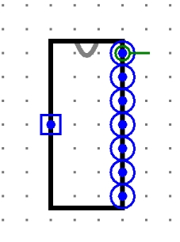
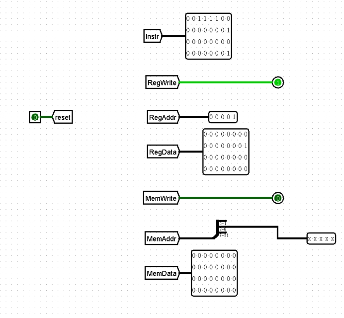
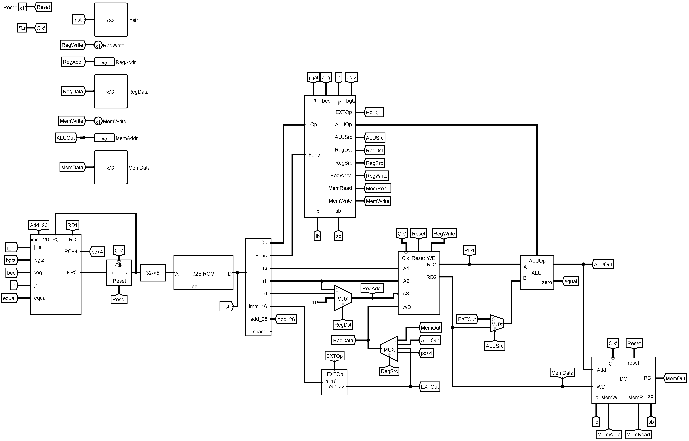

# p3单周期CPU

## 实验要求

使用logism自主搭建出一个支持所给指令集的32位CPU，并通过课下正确性测试。课上会通过新增指令的方式，来考核课下设计的CPU。

- 指令集：`lw`，`sw`，`addu`，`subu`，`ori`，`j`，`beq`。
- 内存大小：32字。只需要一个RAM。
- ROM大小：要求能执行32条指令。ROM不一定需要地址的全部位数。只需要一个ROM。
- PC需要复位功能，起始地址为0x00003000。

## 提供模块

具体说明参考指导书。

`GRF.circ`

**注意：请在提交前清空自己的ROM。在提交前注意unload提供的GRF，以免电路的GRF仍然指向外部库的GRF。顶层模块命名为main顶层模块样式及端口请严格按照以下提交：**

 

- 左侧端口是输入端口：Reset信号。
- 右一端口是Instr：32位指令码。
- 右二端口是RegWrite：1位寄存器堆写入信号。
- 右三端口是RegAddr：5位寄存器编号。
- 右四端口是RegData：32位写入寄存器数据。
- 右五端口是MemWrite：1位DM写入信号。
- 右六端口是MemAddr：5位写入地址。
- 右七端口是MemData：32位写入DM数据。
- 建议main内部端口的相对位置如下排列：

 

## 源文件

`CPU.circ` 这一版本在修改后通过了课下测试和课上测试。顶层模块示意图：

