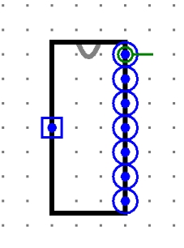
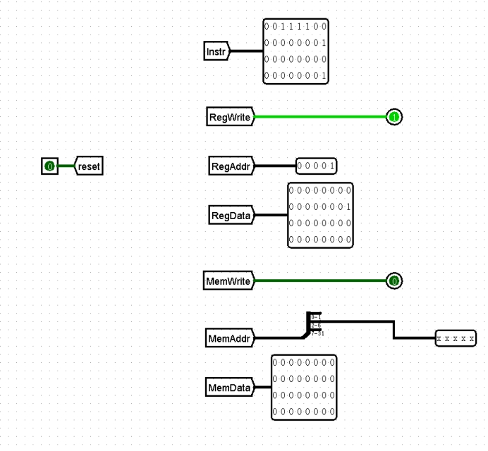

# p4流水线

## 实验要求

使用logism自主搭建出一个支持所给指令集的32位五级流水线CPU，并通过课下正确性测试。

课上会通过新增指令的方式，来考核课下设计的CPU。

**提供的所有模块请在课件下载中获得。**

- 指令集：`lw`，`sw`，`addu`，`subu`，`lui`，`ori`，`jal`，`j`，`beq`，`nop`。
- nop是空指令（`0x00000000`），不进行有效行为（修改内存、寄存器等）。
- 内存大小：32字。
- ROM大小：要求能执行1024条指令。ROM不一定需要地址的全部位数。
- PC需要复位功能，起始地址为`0x00003000`。

## 提交要求

顶层模块命名为`main`

顶层模块样式及端口请严格按照以下提交：

 

- 左侧端口是输入端口：Reset信号，可以对PC、GRF、DM、**流水线寄存器**复位。
- 右一端口是Instr：32位指令码。
- 右二端口是RegWrite：1位寄存器堆写入信号。
- 右三端口是RegAddr：5位寄存器编号。
- 右四端口是RegData：32位写入寄存器数据。
- 右五端口是MemWrite：1位DM写入信号。
- 右六端口是MemAddr：5位写入地址。
- 右七端口是MemData：32位写入DM数据。

**上述所有信号均取自于W段的信号。**

建议`main`内部端口的相对位置如下排列：

 

## 源文件

CPU文件：`CPU.circ`

课程组提供的模块：

- `cpu -cache -流水线寄存器D-E.circ`
- `cpu -cache -流水线寄存器E-M.circ`
- `cpu -cache -流水线寄存器F-D.circ`
- `cpu -cache -流水线寄存器M-W.circ`
- `forwardUnit.circ`
- `GRF.circ`

顶层模块示意图：

