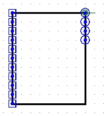
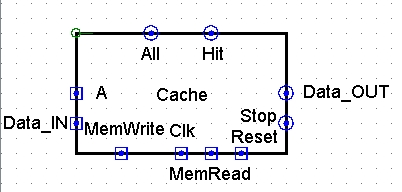

# p5 Cache

## LRU模块测试

为了方便大家搭建Cache，不在不必要的地方出错，我们首先准备了有关Cache核心部分——LRU模块的测试。

LRU模块的行为和指导书一致。

**注意：请保证LRU模块的apperance与下图完全一致，否则可能造成评测错误！**

**请将logisim里的主模块命名为LRU**

#### 左侧接口要求：

| **接口名称**          | **IN/OUT** | **位宽** | **介绍**                                            |
| --------------------- | ---------- | -------- | --------------------------------------------------- |
| 从上往下数第1-4个接口 | IN         | 16       | 从上往下数1到4个接口分别对应第1到4个Block的计数器   |
| 从上往下数第5-8个接口 | IN         | 1        | 从上往下数5到8个接口分别对应第1到4个Block的 Hit信号 |
| 从下往上数第三个接口  | IN         | 1        | MemRead信号                                         |
| 从下往上数第二个接口  | IN         | 1        | MemWrite信号                                        |
| 从下往上数第一个接口  | IN         | 1        | 使能信号                                            |

#### 右侧接口要求：

| **接口名称**          | **IN/OUT** | **位宽** | **介绍**                                                     |
| --------------------- | ---------- | -------- | ------------------------------------------------------------ |
| 从上往下数第1-4个接口 | OUT        | 1        | 从上往下数1到4个接口分别对应第1到4个Block的写使能，也就是每个接口决定了对应的Cache Block是否更新 |

## LRU-四路组相连-Cache功能测试

此实验需要同学们用logisim模拟一个具有如下行为的Cache。

#### 行为要求

| **模块**    | **行为**                                                     |
| ----------- | ------------------------------------------------------------ |
| Cache模块   | MemWrite或者Stop时，Data_OUT输出为0，All和Hit不变。MemRead时，Data_OUT输出正确的结果。Stop时，Stop置1。 |
| Counter模块 | MemRead且命中时，计数器归零。MemRead且不命中时，计数器加一。MemWrite时，计数器不变。 |

 

#### 输入输出要求

**注意：请保证Cache模块的apperance与下图完全一致，否则可能造成评测错误！**（其中字母部分不必一致，只是为了方便同学们理解接口含义）

请将logisim里的主模块命名为Cache

| **接口名称** | **IN/OUT** | **位宽** | **介绍**                              |
| ------------ | ---------- | -------- | ------------------------------------- |
| Addr         | IN         | 32       | 地址信号                              |
| Data_in      | IN         | 32       | 写入的数据信号                        |
| MemRead      | IN         | 1        | 读取信号                              |
| MemWrite     | IN         | 1        | 写入信号                              |
| Clk          | IN         | 1        | 时钟信号                              |
| Reset        | IN         | 1        | 复位信号                              |
| Data_out     | OUT        | 32       | 输出数据信号                          |
| Stop         | OUT        | 1        | 当读取没命中，需要stop时，stop信号置1 |
| ReadTimes    | OUT        | 16       | 总共读取了多少次（不包含写入次数）    |
| HitTimes     | OUT        | 16       | 总共命中了多少次                      |

#### 数据限制

为方便同学们搭建Cache，我们保证输入数据在前五个周期暂停时和第六周期执行时不变。

## 源文件

- `Cache.circ`：完整的Cache文件；
- `CPU.circ`：测试用的CPU；
- `LRU.circ`：LRU模块；
- `RAM.circ`：模拟内存。